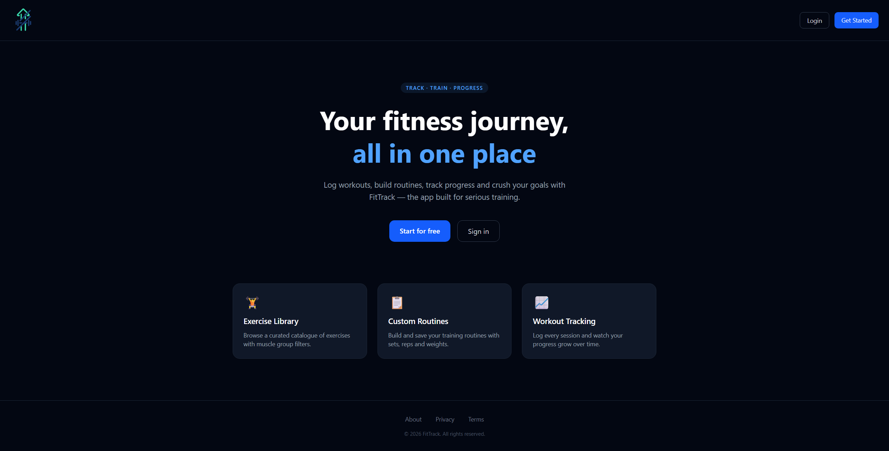
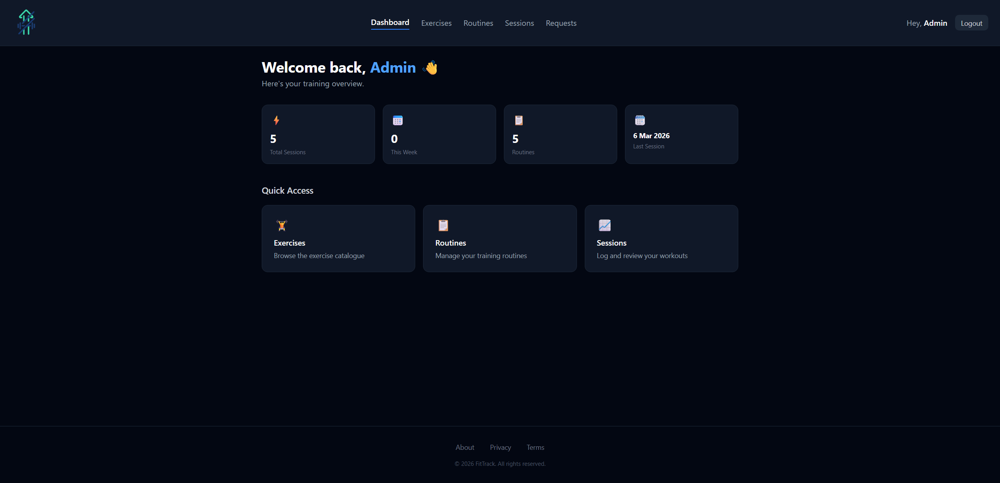
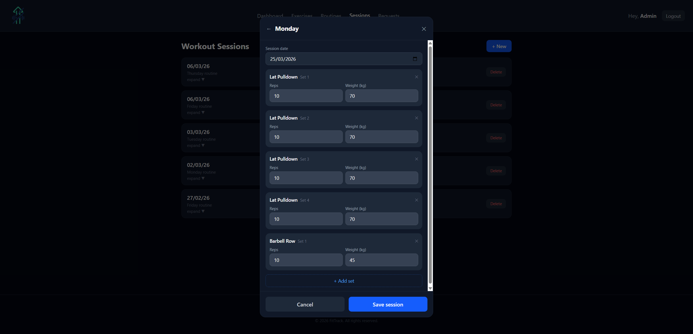
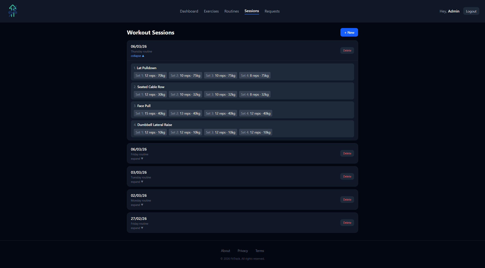
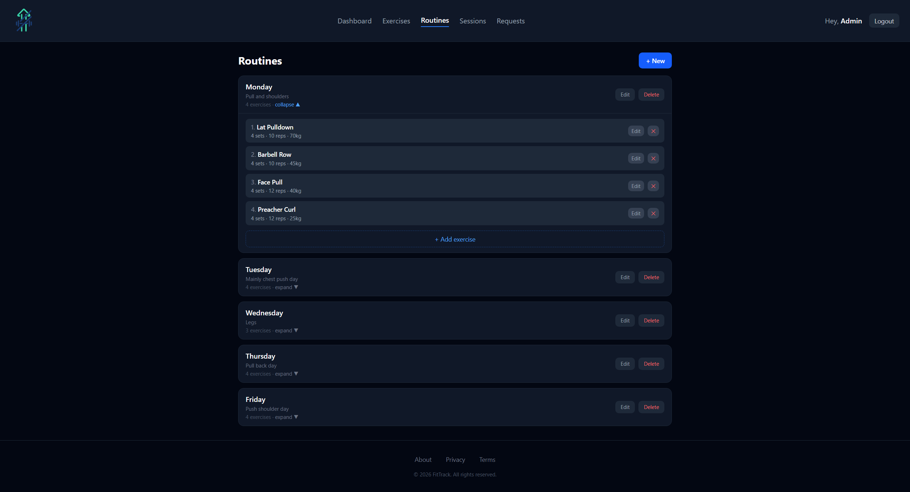
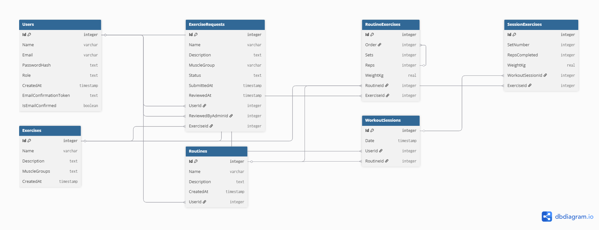

# FitTrack 🏋️

<p align="center">
  
  
  
  
  
  <a href="./LICENSE"></a>
</p>

**FitTrack** is a full-stack training management application that allows users to create workout routines, log training sessions, and track their strength progress over time.

This is a **personal portfolio/learning project**, built to practise full-stack development with React and ASP.NET Core — from data modeling and authentication to deployment and, more recently, working through a self-run security audit (see [`SECURITY_NOTES.md`](./SECURITY_NOTES.md)). The goal is a structured, secure, and scalable fitness tracking platform, not a production product.

> ✅ **Demo status:** Both the frontend (Netlify) and backend (Render) are live — the app is fully functional, including login and data features. Note the backend is on Render's free tier, so the first request after a period of inactivity may take up to a minute to respond while the instance wakes up.

## 📖 Table of Contents

- [Screenshots](#-screenshots)
- [Features](#-features)
- [Tech Stack](#-tech-stack)
- [Database Architecture](#️-database-architecture)
- [Project Structure](#-project-structure)
- [Local Setup](#️-local-setup)
- [Roadmap](#-roadmap)
- [Future Improvements](#-future-improvements)
- [Author](#-author)

## 📸 Screenshots

<p align="center">
  
  
</p>
<p align="center">
  
  
</p>
<p align="center">
  
</p>

🔗 **Live demo:** [https://fittrack-prospi.netlify.app/](https://fittrack-prospi.netlify.app/)

## 🚀 Features

**🔐 Authentication**

- User registration and login (JWT-based authentication)
- Secure password hashing with BCrypt
- Protected and public routes
- Automatic session expiration handling

**🏋️ Exercise Catalogue**

- Browse a curated exercise catalogue with muscle group filtering
- Admin-managed catalogue
- Users can submit exercise requests for review

**📋 Routine Management**

- Create, edit, and delete routines
- Add exercises with sets, reps, and weight
- Reorder exercises within a routine
- Personalized data per user

**📝 Workout Logging**

- Log training sessions linked to routines or as free workouts
- Record sets (weight & reps) per exercise
- View and delete past sessions

**👤 User Profile**

- Update display name
- Change password (with current password verification)
- Delete account

**⚙️ Admin Panel**

- Review and approve/reject user exercise requests
- Approved exercises are automatically added to the catalogue

**🌐 Public Pages**

- Landing page, About, Privacy Policy, Terms of Use
- Contact form (EmailJS)

## 💡 Tech Stack

**Frontend**
- React 19 + Vite
- React Router v7
- Tailwind CSS v4
- Axios
- EmailJS

**Backend**
- ASP.NET Core 9 Web API
- Entity Framework Core
- PostgreSQL
- JWT Authentication
- BCrypt
- FluentValidation

**Infrastructure**
- Docker
- Render (backend deployment)
- Netlify (frontend deployment)

## 🗄️ Database Architecture


The database is designed using a Code-First approach with Entity Framework Core

## 📁 Project Structure

```
FitTrack/
├── Backend/FitTrack/       # ASP.NET Core 9 Web API
│   ├── Controllers/        # API endpoints
│   ├── Services/           # Business logic (auth, JWT, etc.)
│   ├── DTOs/                # Request/response contracts
│   ├── Validators/         # FluentValidation rules
│   ├── Models/              # EF Core entities
│   ├── Data/                 # DbContext
│   └── Migrations/         # EF Core migrations
├── Frontend/FitTrack/      # React 19 + Vite SPA
│   └── src/
└── docs/                   # Screenshots and diagrams used in this README
```

## 🛠️ Local Setup

### Prerequisites
Make sure you have the following installed on your machine:
* [Node.js](https://nodejs.org/) (v18 or higher)
* [.NET 9 SDK](https://dotnet.microsoft.com/download/dotnet/9.0)
* [PostgreSQL](https://www.postgresql.org/download/)
* [Docker](https://www.docker.com/) (Optional, if you want to run the DB via container)

### 1. Clone the repository
```bash
git clone https://github.com/prospi-dev/FitTrack.git
cd FitTrack
```

### 2. Backend Setup (.NET API)
1. Navigate to the backend directory:
   ```bash
   cd Backend/FitTrack
   ```
2. Copy `appsettings.Development.json.example` to `appsettings.Development.json` (this file is gitignored and never committed) and fill in your PostgreSQL connection string and JWT key:
   ```bash
   cp appsettings.Development.json.example appsettings.Development.json
   ```
   ```json
   "ConnectionStrings": {
     "DefaultConnection": "Host=localhost;Database=FitTrackDb;Username=postgres;Password=yourpassword"
   },
   "Jwt": {
     "Key": "a-strong-random-secret-at-least-64-characters-long",
     "Issuer": "FitTrackApi",
     "Audience": "FitTrackClient"
   }
   ```
   Generate a strong random key, e.g.:
   ```bash
   openssl rand -base64 64
   ```

   > If you don't know your local `postgres` user's password (or never set one), connect with `psql -U postgres` and run `ALTER USER postgres WITH PASSWORD 'yourpassword';`, then use that password above.
3. Apply Entity Framework migrations to create the database:
   ```bash
   dotnet ef database update
   ```
   (Optional — migrations also run automatically on startup, see `Program.cs`.)
4. Run the API:
   ```bash
   dotnet run
   ```
   By default this uses the `http` profile (`http://localhost:5111`). Note which profile/port you're on (`https` → `7239`, `http` → `5111`) — the frontend's `VITE_API_URL` must match it.

   > If you use the `https` profile, run `dotnet dev-certs https --trust` first. Without a trusted dev certificate the browser silently blocks the API calls and the frontend just renders a blank screen.

### 3. Frontend Setup (React + Vite)
1. Open a new terminal and navigate to the frontend directory:
   ```bash
   cd Frontend/FitTrack
   ```
2. Install dependencies:
   ```bash
   npm install
   ```
3. Copy `.env.example` to `.env` (or `.env.local`) in the root of the frontend folder and set your API base URL to match the backend profile you ran in step 2 (`https` → `7239`, `http` → `5111`):
   ```env
   VITE_API_URL=http://localhost:5111/api
   ```
4. Start the development server:
   ```bash
   npm run dev
   ```

Now you can open `http://localhost:5173` in your browser to see the app!

## 📌 Roadmap

- [x] Authentication System
- [x] Exercise catalogue
- [x] Exercise requests (user → admin flow)
- [x] Routines CRUD
- [x] Workout session logging
- [x] User profile management
- [x] Admin panel
- [x] Deployment

## 🔮 Future Improvements

- Expand frontend test coverage (vitest + React Testing Library are set up; core auth/routing paths are covered) and add backend unit/integration tests
- CI pipeline (build + lint + test on push)
- Data visualization charts (progress over time)
- Export training history
- Personal records tracking

## 👤 Author

Built by [**prospi-dev**](https://github.com/prospi-dev) as a full-stack learning project.

Feedback and suggestions are welcome — feel free to open an issue or a PR.
